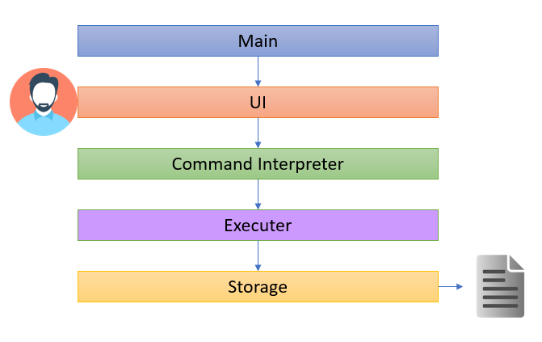

# Chan Jian Xiang - Project Portfolio Page

## 1. Overview
### 1.1 Project Overview 
DOMNUS - is a desktop application that helps in module and task tracking. It was developed under the module CS2113 Software Engineering & Object Oriented Programming. Within the schedule of approximately 7 weeks, my team of 5 Computer Engineering students successfully created DOMNUS to help students to stay organize with respective to the modules they take in NUS. 

This is what out product looks like: 

## 2. Summary of Contributions
Given below are my contributions to the project. 

### 2.1 Enhancements Implemented: 
**MC Feature**: Added the ability to list total number of MCs or the individual components that made up the MC based on the selected list.
**What it does**: Allows the user to print the total number of MC based on the list that he/she is focusing on (i.e list of taken module). See the individual components that made up the total MC using this feature by typing `mc -d`
**Justification**: This feature improves the product as user would want to keep track of his current taken module's MC so as to prevent overloading/under-loading of modules in the upcoming semester. 
**Highlights**: This enhancement works well with the existing CAP calculation feature, as it allows the aforementioned feature to make use of the total MC to do further mathematical calculation of the user's CAP. This aligns with the practice of code reusability. 

**Statistic Feature**: Added the ability to show the statistics of the number of task that have been completed. 
**What it does**: Allows users to track the current completion status of their tasks. 
**Justification**: Very often, students are not sure of how much task have been completed or how much are they left with for the week. This feature enables them to keep track of their weekly progress. 
**Highlights**:  This feature is capable of keeping track of individual module's task progress as well. This works in conjuncture with the ability to add individual task to the modules which allow user to better track his/her progress. 

**Recurrence Feature**: Added the ability to allow user to add Recurring Tasks.
**What it does**: Allows user to add weekly recurring task such as a weekly meeting or weekly quiz. 
**Justification**: It is common to have a weekly meeting amongst the busy students schedule. This features enables the user to do so simply by adding `Weekly` at the end of a deadline or event command. Be it a weekly quiz or weekly CCA meeting, this helps users to quickly setup a weekly schedule. 
**Highlights**: The combination of this feature with the reminder feature done by the 2 other student Computer Engineer on our team, will enable the student using this app to plan ahead of his time for the upcoming schedule. Which is a key factor in productivity for the student. 

**Code Contributed**: 

### 2.2 Contributions to UG: 
The following section shows my contribution to the DOMNUS User Guide. It includes: Domsun Tutorial, mc and stats. 
{start of extract}
{end of extract} 
The Domsun tutorial section was a result of the peer feedback during the PE Dry run. As i realised the importance of building the intuition in user to know how the app actually works, i decided to bridge the learning gap by providing a pictorial guide for the user. 

{start of extract} 
mc 
stats
{end of extract} 

### 2.3 Contributions to DG:
The following section shows my contribution to the DOMNUS Developer Guide. It includes: Introduction, Setting up, (Design) 4.1, 4.2, 4.5, 4.6, (Implementation) 5.2, Appendix A,B,C,D,E,F. 
{start of extract}
### 4.1 Architecture
The **Architecture Diagram** below represents a high-level design overview of the App. Specifically, it is done with an N-tier architectural style, where the higher layers make use of services provided by lower layers. 

As shown in the above diagram, user only interacts with the UI layer and their commands, in turn will be passed to next adjacent layer. Given below is a quick overview of each component. 

**4.2 Main Layer** 
The `main` layer, it contains a single class known as `Domnus`. Its purpose can be split into 3 parts: 

At Start Up: It calls upon the `storage` component to load user's past data and it also loads the complete module list that is packaged inside the JAR file.  
At Operating: It connects the relevant component of the program to ensure the program is operating as per the intended logic flow.  
At Shutdown: It exits the running loop of the program to shutdown the program successfully.  

**4.5 Execute Layer** 
The `Execute` layer carries out the relevant actions required based on the analyzed input. All of the features in the program are stored under this layer which is under the package name `command`. To summarize, this layer is responsible for: 

1) Match the user's command to the relevant actions.
2) Throw any exception based on errorneous user input/invalid conditions. 

**4.6 Storage Layer** 
The `Storage` layer loads, saves, and do pre-data processing before performing the two aforementioned action. It is active in 2 phases. 

During loading phase: 
1) For the user's task: This layer translates the previously (if any) saved data format into recognizable commands and loads these data as per how the app functions during runtime. 
2) For the module list: This layer conducts simple parsing of the text file containing all the modules and stores them creates individual item known as `SingleModule` before loading them into an arraylist. 

During saving phase: 
1) For the user's task: This layer saves any changes that the user made to the task list onto a text file. 
2) For the module list: This layer saves any module marked `TAKEN` by the user onto a text file, together with the relevant module information such as module's code, and grade attained (if any).  

### 2.4 Contributions to team-based tasks: 
1. Retrieved a complete list of Module Data that includes its relevant details such as Module Code, MC, Prerequisites, etc. 
2. Wrote the ModuleParser code for (which was really taxing amount of data to sieve through due to incompatible formatting from excel into text file).
3. For UG: Wrote the 'Domnus Tutorial' section 
4. For DG: Wrote the Introduction, Setting up, (Design) 4.1, 4.2, 4.5, 4.6, Appendix A,B,C,D,E,F
5. Planned and recorded the first and second video demo. 
6. 
### 2.5 Review/monitoring contributions: 

### 2.6 Contributions beyond the project team:  
 **2.6.1 Community**
<!--stackedit_data:
eyJoaXN0b3J5IjpbMzc0ODg3NjY0LC0yMTIyNDI1MTIxXX0=
-->