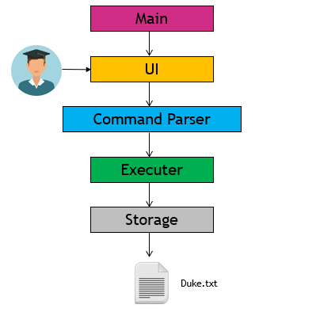

# Developer Guide

## 1. Table of content
**1. Table of content**
**2. Setting Up** 
    2.1 Prerequisites
	2.2 Setting up the project on your own Device 
**3. Design** 
	3.1 Architecture  
	3.2 Main Layer 
	3.3 UI Layer 
	3.4 Command Interpreter Layer
	3.5 Executor Layer 
	3.6 Storage Layer 
**4. Implementation**
	4.1 Interpreting a 
**5. Appendix A Product Scope** 
**6. Appendix B User Stories** 
**7. Appendix C Use Cases** 
**8. Appendix D Non-funcitonal Requirements** 
**9. Appendix E Glossary** 
**10. Appendix F. Instruction for Manual Testing**

## 2. Setting Up
1.  Ensure that you have Java 11 or above installed.
2.  Download the latest version of  `Duke`  from  [Our Release Page](https://github.com/AY2021S1-CS2113-T13-2/tp/releases/tag/v1.0).
3.  Copy the file to the folder you want to use as the home folder for your Mobile Nusmod.
4.  Open the Command Prompt if you are running on Windows or Terminal if you are running on Mac OS.
5.  Navigate to your home folder and type ‘java -jar domnus.jar’
6.  Type ‘bye’ to terminate your session.

## Design

The Architecture Diagram below represents a high-level design overview of the App. Specifically, it is done with an n-tier architectural style, where the higher layers make use of services provided by lower layers. 

**Main**
For the main layer, it contains a single class known as *Duke*. 
Main's interaction with Storage 
When the app launches, Duke loads any previous data from storage and then connects the components of the app in sequence. Upon shutting down,  Duke calls upon method to save user's data automatically.  

Main's interaction with UI
Main gets user input and displays messages through the use of UI component. 

Main's interaction with Command Interpreter 
Upon receiving command from the UI, Duke would pass the entire user input into Command Interpreter (CI)

Main's interaction with Execute 
Once CI processed the user input, duke proceeds to redirect the input to Execute for execution of action. 

**UI**
**Command Interpreter**
**Executer**
**Storage**

## Implementation
[add ur individual features here]

## Appendix A. Product scope
### Target user profile

{Describe the target user profile}

### Value proposition

{Describe the value proposition: what problem does it solve?}

## Appendix B. User Stories

|Version| As a ... | I want to ... | So that I can ...|
|--------|----------|---------------|------------------|
|v1.0|new user|see usage instructions|refer to them when I forget how to use the application|
|v2.0|user|find a to-do item by name|locate a to-do without having to go through the entire list|

## Appendix C. Non-Functional Requirements

{Give non-functional requirements}

## Appendix D. Glossary

* *glossary item* - Definition

## Appendix E. Instructions for manual testing

{Give instructions on how to do a manual product testing e.g., how to load sample data to be used for testing}
<!--stackedit_data:
eyJoaXN0b3J5IjpbLTU3ODU0OTI2MSwzOTUxODM1MjgsLTE2OT
E0OTQyMzYsLTI2MjY0MzMyOCwtMTg3MjEyNzAzNCw4MjY0MjA3
MjYsMTQ2MDQ4NzIyMCwxODE4NTAxOTUwLC0xODA2MDI2MCwyMD
E1MDYyMTEwLDExNTIwOTkxODMsMTc1ODM5NzYxNF19
-->